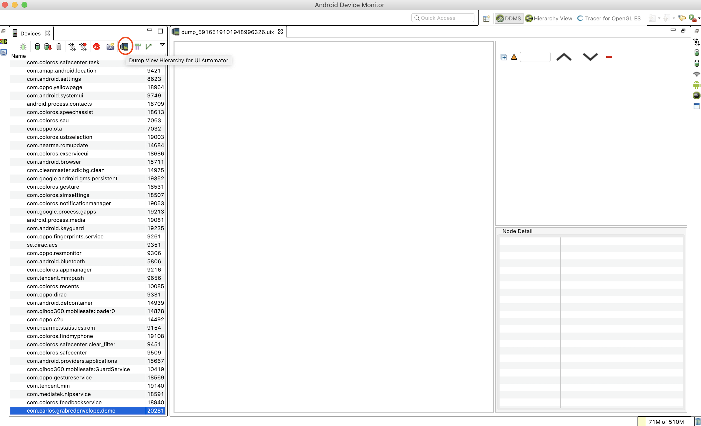
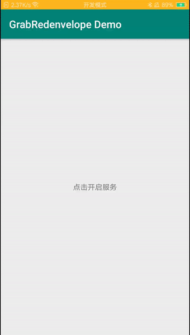

# Android通过辅助功能实现抢微信红包原理简单介绍

## 前言
相信很多人见过群里总会有人抢红包速度很快，也可能有人用过抢红包外挂，那么他们是什么原理实现的呢？
目前一般用得最多的就是通过AccessibilityService无障碍服务监控UI模拟点击实现对，另外还有一种方式可以通过Xposed直接Hook微信的代码调用。
通过Hook需要手机Root，并且要反编译结合源码分析，找到关键Hook点。
今天就简单介绍下Android抢微信红包外挂的实现原理和简单Demo，如果你用Uiautomator或Appium写过Android脚本应该知道实现的过程其实很简单。注：以下是基于Android版微信7.0.3版本。

## 知识点
本章会用到的相关知识工具，如果有不了解的Google一下你就知道：
DDMS，AccessibilityService，Kotlin语言，

## UI分析
- 首先我们打开安装的SDK目录，MAC下可以在Finlder按Shift+Command+G快捷键快速进入。
如我的SDK目录是/Users/caochang/Library/Android/sdk。进入tool文件夹打开monitor分析工具。如果是Eclipse的话可以直接打开DDMS
- 手机连接电脑打开USB调试，可以通过adb devices命令查看是否连接上，如果连接不成功可以试试adb kill-server然后adb start-server。
- 手机连接上后选中要看当前页面视图的进程名，如下图选中的当前测试的APP，点击圈中的图标中间就会显示当前顶层Activity视图如下：

- 手机发个红包然后查看视图如下，我们可以找到id和text:

- 同理我们点击红包，进入红包弹框，可以找到点击拆的ID如图：     


## 代码实现
本例子使用到了'com.github.xbdcc:Cutils:0.0.10'中的一些工具类，代码用Code Style-Kotlin格式化过。
- 首先我们在自己写的继承AccessibilityService类实现的onAccessibilityEvent方法里面判断当前是通知还是界面还是内容改变了：
```kotlin
        when (event.eventType) {
            AccessibilityEvent.TYPE_NOTIFICATION_STATE_CHANGED -> {
                LogUtils.d("通知改变:$event")
            }
            AccessibilityEvent.TYPE_WINDOW_STATE_CHANGED -> {
                LogUtils.d("界面改变:$event")
                openRedEnvelope(event)
            }
            AccessibilityEvent.TYPE_WINDOW_CONTENT_CHANGED -> {
                LogUtils.d("内容改变:$event")
                clickRedEnvelope()
            }
        }
```
- 找到相关的Activity类名和id或者text代码：
```kotin
    private val WECHAT_PACKAGE = "com.tencent.mm"
    private val WECHAT_LUCKYMONEY_ACTIVITY =
        "$WECHAT_PACKAGE.plugin.luckymoney.ui.LuckyMoneyNotHookReceiveUI" //微信红包弹框

    private val RED_ENVELOPE_FLAG_ID = "com.tencent.mm:id/aq7" //聊天页面区分红包id
    private val RED_ENVELOPE_ID = "com.tencent.mm:id/aou" //聊天页面红包点击框控件id
    private val RED_ENVELOPE_OPEN_ID = "com.tencent.mm:id/cyf" //抢红包页面点开控件id
```
- 发现红包点击红包代码：
```kotlin
    private fun clickRedEnvelope() {
        //如果没找到红包就不继续往下执行
        if (!AccessibilityServiceUtils.isExistElementById(
                RED_ENVELOPE_FLAG_ID,
                rootInActiveWindow
            )
        ) return
        //点击红包
        AccessibilityServiceUtils.findAndClickOneById(RED_ENVELOPE_ID, rootInActiveWindow)
    }
```
- 出现红包弹框页面拆开红包代码：
```kotlin
    private fun openRedEnvelope(event: AccessibilityEvent) {
        //如果当前页面不是微信红包弹出框则不继续往下执行
        if (WECHAT_LUCKYMONEY_ACTIVITY != event.className) return
        AccessibilityServiceUtils.findAndClickOneById(RED_ENVELOPE_OPEN_ID, rootInActiveWindow)
    }
```

## 测试效果


## 结语
以上就是实现微信自动抢红包的简单demo，你还可以做些优化做监听通知监听页面判断抢红包，以及延迟点击过滤口令，判断红包是否已抢等。
